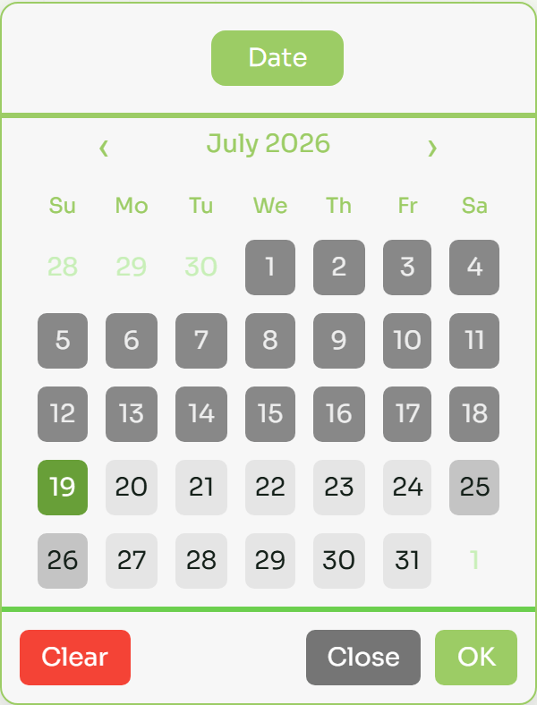
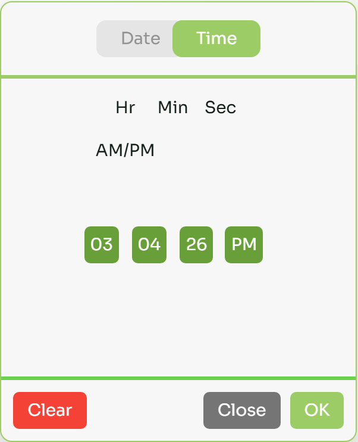
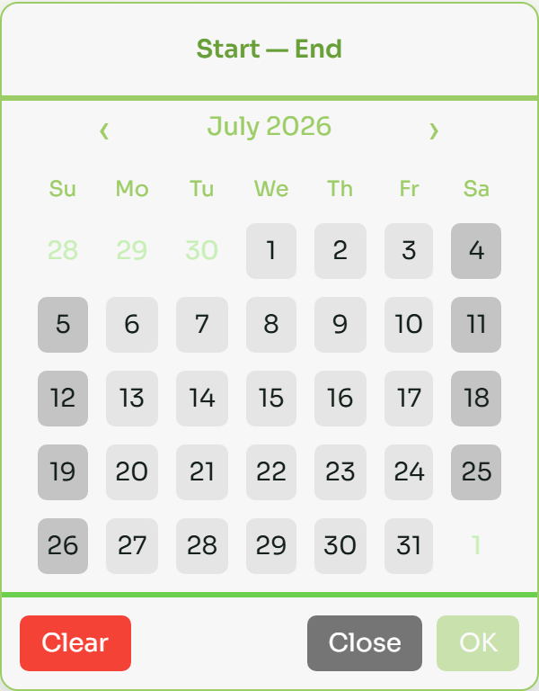
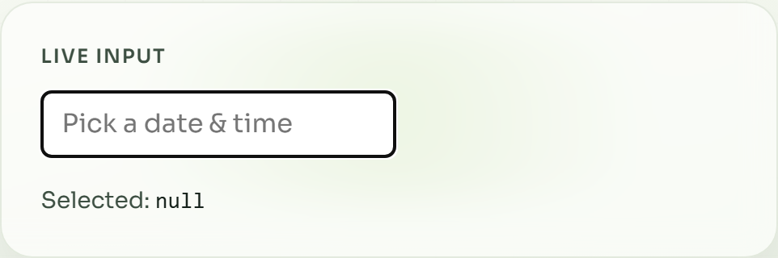

[](https://www.npmjs.com/package/react-datetime-picker-component)
[](https://github.com/Bhardwaj-Raghav/react-datetime-picker-component/actions/workflows/ci.yml)

# react-datetime-picker-component

Accessible React date and time picker with TypeScript types, controlled/uncontrolled APIs, and CSS variable theming.

## Install

```bash
npm install react-datetime-picker-component
```

```bash
yarn add react-datetime-picker-component
```

Peer dependencies: `react` and `react-dom` (≥ 17).

## Screenshots

| Date | Time |
|------|------|
|  |  |

| Range | Input |
|-------|-------|
|  |  |

## Quick start

```tsx
import { useState } from "react";
import DateTime, { DateTimeInput } from "react-datetime-picker-component";
import "react-datetime-picker-component/style.css";

function App() {
  const [value, setValue] = useState<string | null>(null);

  return (
    <>
      <DateTimeInput value={value} onChange={setValue} />
      <DateTime inline value={value} onChange={setValue} />
    </>
  );
}
```

## Components

| Export | Description |
|--------|-------------|
| `DateTime` | Overlay or inline picker |
| `DateTime.Input` / `DateTimeInput` | Read-only input that opens a popover picker |
| `DateTime.Range` / `DateTimeRange` | Date range selection |

## Props

### Shared (`DateTime` / `DateTimeInput`)

| Prop | Type | Default | Description |
|------|------|---------|-------------|
| `value` | `Date \| string \| Dayjs \| null` | — | Controlled value |
| `defaultValue` | same | — | Uncontrolled initial value |
| `onChange` | `(value: string \| null) => void` | — | Fired on OK / Clear |
| `format` | `string` | `YYYY-MM-DD HH:mm:ss` | dayjs format |
| `mode` | `"datetime" \| "date" \| "time"` | `"datetime"` | Picker mode |
| `minDate` / `maxDate` | date-like | — | Inclusive bounds |
| `disablePastDates` | `boolean` | `false` | Disable days before today |
| `disableFutureDates` | `boolean` | `false` | Disable days after today |
| `weekStartsOn` | `0–6` | `0` | First day of week (0 = Sunday) |
| `use12Hours` | `boolean` | `false` | 12-hour clock with AM/PM |
| `locale` | `string` | `"en"` | dayjs locale (import locale first) |
| `inline` | `boolean` | `false` | Render without overlay |
| `className` | `string` | — | Root class |

### Overlay control

| Prop | Type | Description |
|------|------|-------------|
| `open` / `defaultOpen` | `boolean` | Controlled / uncontrolled open state |
| `onOpenChange` | `(open: boolean) => void` | Open state changes |
| `popover` | `boolean` | Position near `anchorEl` instead of fullscreen |
| `anchorEl` | `HTMLElement \| null` | Anchor for popover |

### `DateTimeInput` extras

`placeholder`, `id`, `name`, `disabled`, `readOnly`, `aria-label`, `aria-labelledby`, `inputClassName`

### `DateTimeRange`

`onChange` receives `{ start: string | null; end: string | null }`.

## Theming

Override CSS variables:

```css
:root {
  --ctp-primary: #9ccc65;
  --ctp-primary-dark: #689f38;
  --ctp-surface: #f7f7f7;
  --ctp-danger: #f44336;
}
```

## Locales

```tsx
import "dayjs/locale/fr";
import { DateTime } from "react-datetime-picker-component";

<DateTime locale="fr" weekStartsOn={1} inline onChange={console.log} />
```

## Development

```bash
npm install
npm test             # unit tests (Vitest)
npm run test:watch   # watch mode
npm run dev          # interactive playground (localhost:5173)
npm run website      # marketing landing + live demo (localhost:5174)
npm run storybook    # Storybook (localhost:6006)
npm run build
npm run website:build  # static site → site-dist/
npm run screenshots    # refresh examples/*.png for the README
```

## License

MIT
